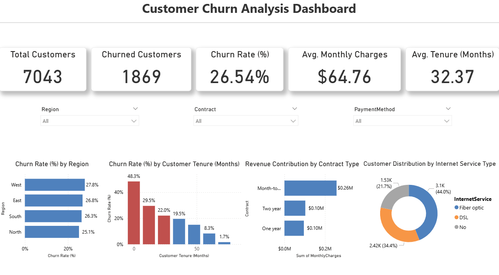
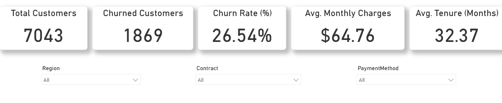
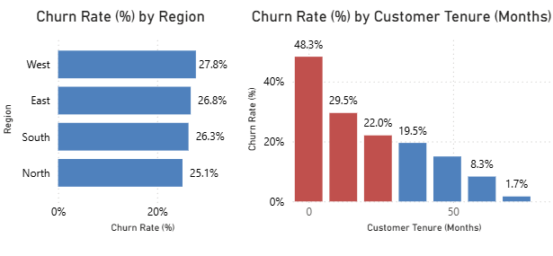
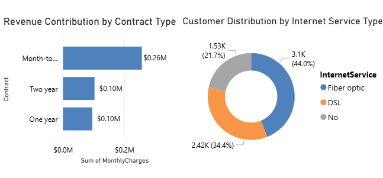

# Customer Retention & Churn Risk Dashboard – Power BI

## Overview
This project simulates a real-world business case for a telecom company experiencing high customer churn.  
The goal is to analyze churn patterns, identify high-risk customer segments, and provide data-driven recommendations to improve retention and protect revenue.

## Dataset
**Source:** Telecom Customer Churn Dataset (public)  
**Size:** 7,043 customer records with demographics, account, and service usage fields.

## Assumptions
- The dataset approximates a real telecom customer base and churn history.
- Missing values were cleaned or reasonably imputed.
- Monthly and total charges are in USD.
- “Churn” means the customer discontinued service in the dataset’s final month.
- The dataset is accurate enough for retention and churn analysis at the time of reporting.

## Key Insights
- Short-tenure customers (< 12 months) show the highest churn risk.
- Fiber optic customers churn more than DSL users.
- Month‑to‑month contracts correlate with higher churn compared to 1–2 year contracts.
- Higher monthly charges are associated with increased churn likelihood.

## KPIs
- Total Customers
- Total Churned Customers
- Churn Rate (%)
- Average Monthly Charges
- Average Tenure (months)

## Dashboard Preview

### Full View

### KPI & Filters

### Churn Analysis

### Revenue & Service

## Features
- Interactive slicers (region, contract type, payment method)
- Conditional formatting to highlight early‑tenure churn risk
- Consistent, professional visual styling (colors, spacing, typography)
- Clear KPIs with standardized formatting and currency

## Tools & Technologies
- Power BI (data modeling, visuals, interactions)
- Power Query (data cleaning and transformation)
- DAX (measures and KPIs)

## How to Use
1. Download `telecom_retention_dashboard.pbix`.
2. Open in Power BI Desktop.
3. Use slicers to explore churn patterns and retention opportunities.

## Files
- `telecom_retention_dashboard.pbix` — Power BI project
- `dashboard_full.png` — Full dashboard screenshot
- `dashboard_kpis_filters.png` — KPIs and slicers
- `dashboard_churnrate_insights.png` — Tenure + Region churn visuals
- `dashboard_revenue_service.png` — Revenue by contract + service distribution
- `telecom_retention_dashboard.pdf` — Printable dashboard (optional)

## License
This repository is for portfolio and educational purposes. The dataset is publicly available.
